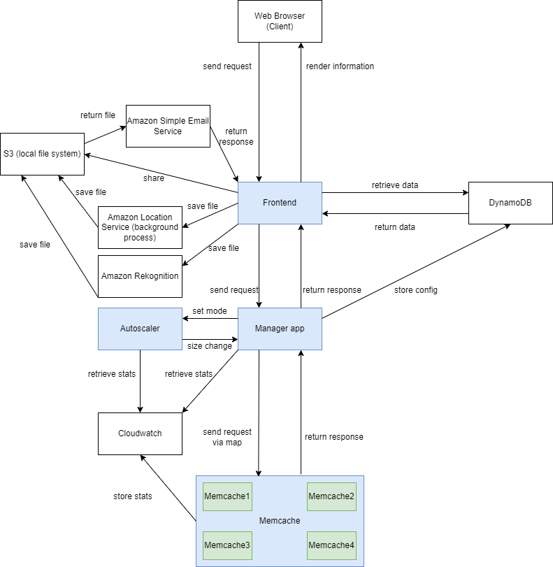

# ECE1779_Group22_a3

## Project description
Searching for images that truly meet the requirement is problematic. 
However, we have made it more accessible. 
Our application is a public cloud image resource-sharing platform that helps users to retrieve images of different categories and locations. 
Unlike other applications, our application also supports downloading the photos for you and sending them to your designated email. 
If you are still suffering searching for images in Google, please try our application which will give you an ideal result.


## General Architecture


The diagram above shows the general architecture of our application.

When the user wants to add an image to the system, he can choose whether he would like to share the image's location information by entering a city name or getting his current location. 
Suppose he decides to get his current location. In that case, the frontend will invoke a lambda function that works as a background process that utilizes the Amazon Location Service to retrieve his current city. 
The image will then be marked as a photo taken in that city if it is a scenery picture.

Regardless of whether the user would like to share his location, the system will use Amazon Rekognition to categorize each image and save the image with different labels.

Users can search for a specific location or label to retrieve the photo album with the specified requirement. 
If the user wants to search for a tag, the system will create a WordCloud to show the current labels existing in the system, which helps users identify non-empty photo album keywords. 
While if the user wants to search for a location, a map will be shown in the browser with all cities pinned on the map. 
This is also reached by a background process that marks all latitudes and longitudes of all locations.

In addition to the two features mentioned above, the user can share a specific album to his email. 
The AWS Simple Email Service helps realize the function by asking the user to verify his email and then sending the email.

## Run the application
```
./start.sh
```
